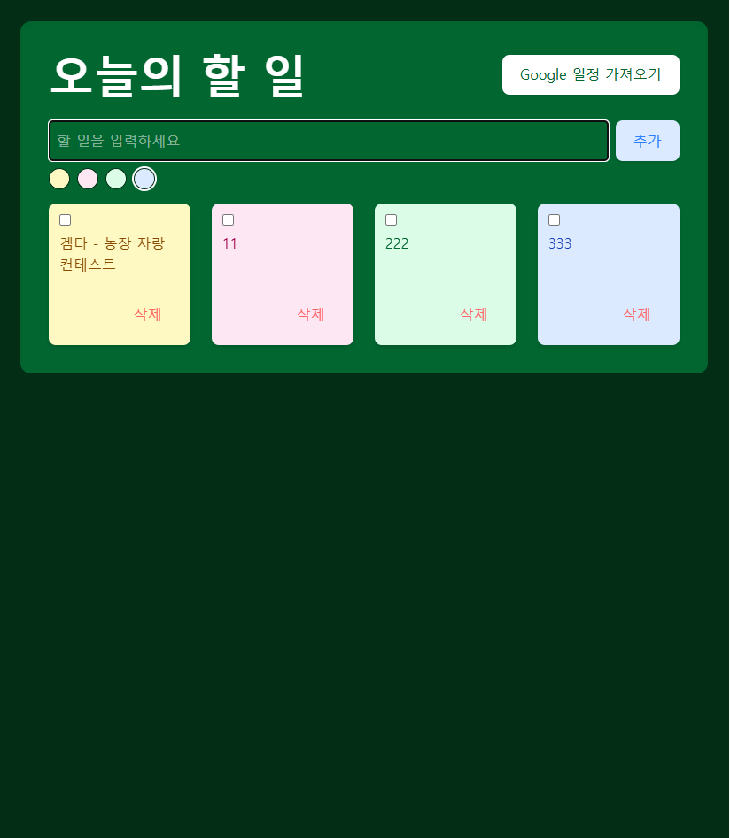

# 📅 Todo App with Google Calendar

Google Calendar와 연동되는 포스트잇 스타일의 To-Do 리스트 앱입니다.  
사용자는 직접 할 일을 입력하거나, 구글 캘린더에 등록된 오늘의 일정을 불러와 자동으로 할 일 목록에 추가할 수 있습니다.

---

## ✨ 주요 기능

- ✅ 간단한 To-Do 목록 추가, 체크, 삭제
- 🗓️ Google Calendar에서 **오늘의 일정 자동 가져오기**
- 🎨 포스트잇 스타일 카드 UI (색상 선택 가능)
- 🧩 TypeScript + React + Vite + TailwindCSS 기반
- 🔒 `.env`를 통한 보안 키 분리 및 환경 설정 관리

---

## 📸 데모

---

## 🔧 기술 스택

| 기술         | 설명                         |
| ------------ | ---------------------------- |
| React        | 컴포넌트 기반 UI 개발        |
| TypeScript   | 정적 타입으로 안정성 확보    |
| Vite         | 빠른 개발 서버 및 빌드 도구  |
| Tailwind CSS | 유틸리티 기반 CSS 프레임워크 |
| gapi-script  | Google Calendar API 연동     |
| uuid         | 고유한 To-Do ID 생성         |

---

## 📁 프로젝트 구조
